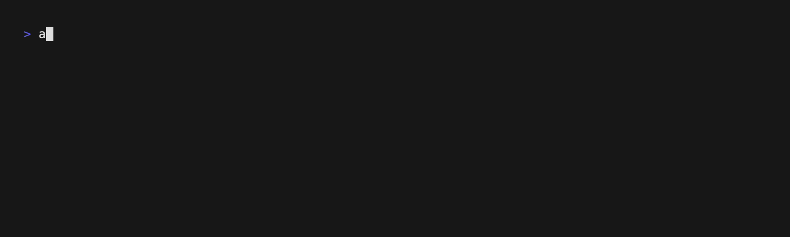
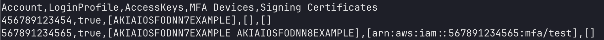

<p align="center">
  
</p>

# AWS Root Manager

A CLI tool for easily manage [AWS Centralized Root Access](https://docs.aws.amazon.com/IAM/latest/UserGuide/id_root-enable-root-access.html).

## Overview

This tool enables AWS Organization administrators to manage centralized root access, allowing you to:
- ✅ Check if Centralized Root Access is enabled in your AWS Organization.
- 🔒 Enable Centralized Root Access for better security and control.
- 📊 Audit root access status across all organization accounts.
- 🗑️ Delete root credentials to enforce security best practices.



## Features

- **Audit**: Get a detailed view of available root credentials in your organization member accounts.
- **Delete**: Remove root credentials with options for:
  - Login profiles.
  - Access keys.
  - MFA devices.
  - Signing certificates.
  - S3 bucket policies *(coming soon)*.
  - SQS policies *(coming soon)*.
- **Check**: Verify centralized root access settings.
- **Enable**: Enable centralized root access.
- **Recovery**: Allow root password recovery.

Something missing? Open us a [feature request](https://github.com/unicrons/aws-root-manager/issues/new?template=feature_request.md)!

## Requirements

- Access to an AWS Organization **management** account from your terminal.
- The following IAM permissions:
  ```
  iam:ListOrganizationsFeatures
  organizations:DescribeOrganization
  organizations:ListAccounts
  sts:AssumeRoot
  ```

  Additionally, if the **centralized root access** feature is not enabled, the following permissions are required to enable it:
  ```
  iam:EnableOrganizationsRootCredentialsManagement
  iam:EnableOrganizationsRootSessions (required only when working with resource policies)
  organizations:EnableAwsServiceAccess
  ```

## How to use it

### Installation

Download the latest version from [GitHub Releases](https://github.com/unicrons/aws-root-manager/releases), or build it from source:
```bash
git clone https://github.com/unicrons/aws-root-manager.git
cd aws-root-manager
go build
```

```bash
./aws-root-manager --help
```
```
Usage:
  aws-root-manager [command]

Available Commands:
  audit       Retrieve root credentials
  check       Check if centralized root access is enabled
  delete      Delete root credentials
  enable      Enable centralized root access
  recovery    Allow root password recovery

Flags:
  -h, --help            help for aws-root-manager
  -o, --output string   Set the output format (table, json, csv) (default "table")
```

### Examples

Get available root credentials for all member accounts in your AWS Organizations:
```bash
aws-root-manager audit --accounts all
```


Get available root credentials for accounts `456789123454` and `567891234565` in `csv`:
```bash
aws-root-manager audit --accounts 456789123454,567891234565 --output csv
```


Delete all organization member accounts root credentials:
```bash
aws-root-manager delete all --accounts all
```


Delete root login profile for account `234567891232`:
```bash
aws-root-manager delete login --accounts 234567891232
```


Check if centralized root access is enabled:
```bash
aws-root-manager check
```


Enable centralized root access:
```bash
./aws-root-manager enable
```


### Logger

The tool uses a logger that, by default, is set to `INFO` level and outputs logs in `text` format. You can customize the logging behavior using environment variables:

- `LOG_LEVEL`: Available options are `trace`, `debug`, `info`, `warn` and `error`. Default: `info`.
- `LOG_FORMAT`: Available options are `text` and `json`. Default: `text`.

## Security

- All root credentials in this app are obtained using `sts:AssumeRoot` API, which is limited by design by AWS using AWS-managed task policies.
- Root credentials obtained via `sts:AssumeRoot` cannot be used to perform actions beyond those defined in the task policies.
- No credentials are stored by the tool - all operations are performed in-memory.
- The recovery command uses `IAMCreateRootUserPassword` task policy to only initiate the password recovery process and does not provide access to root credentials.

For more information about AWS root user privileged tasks, see the [AWS Documentation](https://docs.aws.amazon.com/IAM/latest/UserGuide/id_root-user-privileged-task.html).

### Permissions and Task Policies

Each command requires specific AWS-managed task policies when using `sts:AssumeRoot`. You can restrict which task policies are allowed using the `sts:TaskPolicyArn` IAM condition. Here are the task policies used by each command:

- **audit**: [`IAMAuditRootUserCredentials`].
- **check**: [].
- **delete**: [`IAMAuditRootUserCredentials`, `IAMDeleteRootUserCredentials`, `S3UnlockBucketPolicy`, `SQSUnlockQueuePolicy`].
- **enable**: [].
- **recovery**: [`IAMCreateRootUserPassword`].

Example:
```json
{
    "Version": "2012-10-17",
    "Statement": [
        {
            "Effect": "Allow",
            "Action": "sts:AssumeRoot",
            "Resource": "arn:aws:iam::<MEMBER_ACCOUNT_ID>:root",
            "Condition": {
                "StringEquals": {
                    "sts:TaskPolicyArn": [
                        "arn:aws:iam::aws:policy/root-task/IAMAuditRootUserCredentials",
                        "arn:aws:iam::aws:policy/root-task/IAMDeleteRootUserCredentials"
                    ]
                }
            }
        }
    ]
}
```

## Contributing

Contributions are welcome! Please feel free to submit a Pull Request. For major changes, please open an issue first to discuss what you would like to change.

## References

- [AWS Organizations Documentation](https://docs.aws.amazon.com/organizations/latest/userguide/orgs_introduction.html)
- [AWS Centralized Root Access Documentation](https://docs.aws.amazon.com/IAM/latest/UserGuide/id_root-enable-root-access.html)

---

Made with ❤️ by [unicrons.cloud](https://unicrons.cloud/en/about_us/) 🦄
